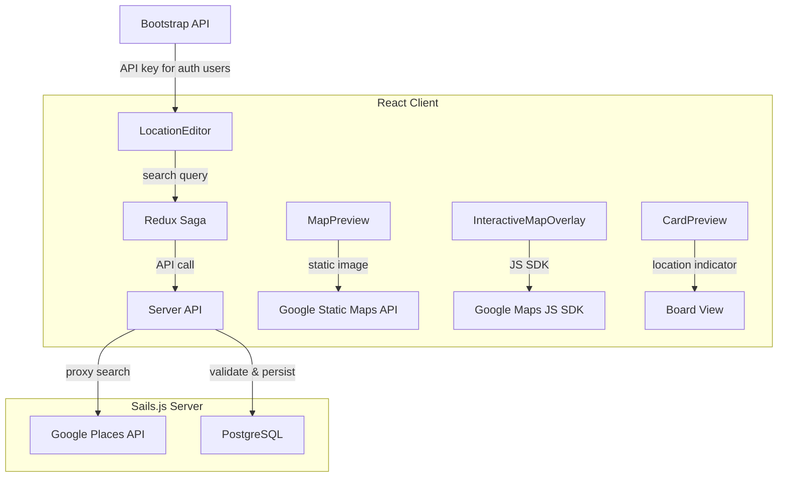

# Design Document: Card Location

## Overview

This feature adds location support to cards in Planka, enabling users to search for places via the Google Maps Places API, attach them to cards, and view map previews. The design integrates with the existing card update flow — the location is stored as a nullable JSON column on the `card` table and flows through the standard Redux + Sails.js pipeline.

Key design decisions:
- **Location as a JSON column**: Rather than creating a separate table, location data is stored as a JSON column on the `card` table. This aligns with how `stopwatch` data is already stored and avoids join overhead for a 1:1 relationship.
- **Feature gated by environment variable**: The Google Maps API key is provided via `GOOGLE_MAPS_API_KEY` env var. When unconfigured, the feature is hidden entirely from the UI.
- **Static map for preview, JS SDK for overlay**: The map preview uses the Google Maps Static API for performance (single image request), while the interactive overlay uses the full Maps JavaScript SDK for pan/zoom.
- **Server-side proxy for Places API**: The Places API is called from the server to protect the API key from being used directly in unrestricted browser requests, enabling server-side request quotas and key restriction.

## Architecture



### Data Flow

1. **Bootstrap**: Server reads `GOOGLE_MAPS_API_KEY` from env. If configured, includes it in the bootstrap response for authenticated users. Client stores it in Redux state.
2. **Search**: User types in LocationEditor → client calls server endpoint `/cards/:id/location-search?query=...` → server proxies to Google Places API → returns results to client.
3. **Save**: User selects a result → client dispatches `updateCard` with location data → server validates → persists to DB → broadcasts via WebSocket.
4. **Display**: Card detail reads location from Redux store → renders MapPreview (static image) and location info. Card preview in board view shows location icon + truncated place name.
5. **Interactive Map**: User clicks MapPreview → opens InteractiveMapOverlay modal using Google Maps JS SDK.

## Components and Interfaces

### Server Components

#### 1. Location Validator (`server/utils/validators.js`)

```javascript
const isLocation = (value) => {
  if (_.isNull(value)) return true;
  if (!_.isPlainObject(value)) return false;
  if (_.size(value) !== 4) return false;
  if (!_.isString(value.placeName) || value.placeName.length === 0 || value.placeName.length > 256) return false;
  if (!_.isNumber(value.latitude) || value.latitude < -90 || value.latitude > 90) return false;
  if (!_.isNumber(value.longitude) || value.longitude < -180 || value.longitude > 180) return false;
  if (!_.isString(value.formattedAddress) || value.formattedAddress.length > 512) return false;
  return true;
};
```

#### 2. Card Update Controller Extension (`server/api/controllers/cards/update.js`)

Add `location` to the inputs with custom validator `isLocation`, and include it in `availableInputKeys` for editors.

#### 3. Location Search Endpoint (`server/api/controllers/cards/location-search.js`)

New endpoint that proxies search queries to the Google Places API. Only available when `GOOGLE_MAPS_API_KEY` is configured and user is authenticated.

```
GET /cards/:id/location-search?query=<text>
Response: { items: [{ placeName, latitude, longitude, formattedAddress }] }
```

#### 4. Bootstrap Helper Extension (`server/api/helpers/bootstrap/present-one.js`)

Add `googleMapsApiKey` to the bootstrap response for authenticated users when configured. Add `isLocationEnabled` boolean.

#### 5. Card Duplicate Helper Extension (`server/api/helpers/cards/duplicate-one.js`)

Add `'location'` to the `_.pick` array used when creating the duplicate card, ensuring location data is copied.

### Client Components

#### 6. Location Button in Card Modal ("Add to Card" column)

The Location button is added to the "Add to Card" sidebar in `ProjectContent.jsx`, positioned immediately after the Attachment button and before the Custom Field button. It follows the same pattern as existing buttons:

```jsx
{canAddLocation && (
  <LocationEditorPopup cardId={card.id}>
    <Button fluid className={classNames(styles.actionButton, styles.hidable)}>
      <Icon name="map marker alternate" className={styles.actionIcon} />
      {t('common.location')}
    </Button>
  </LocationEditorPopup>
)}
```

The button is conditionally rendered based on:
- User is an editor of the card (`canAddLocation: isEditor`)
- The location feature is enabled (`isLocationEnabled` from bootstrap state)

#### 7. LocationEditorStep (`client/src/components/cards/CardModal/LocationEditorStep/`)

An inline popup step component that opens when the Location button is clicked, using the same `usePopupInClosableContext` pattern as `AddTaskListStep` and `AddAttachmentStep`. The popup anchors to the Location button and renders inline within the card modal (not a separate modal or page navigation).

Registered in `ProjectContent.jsx`:
```javascript
const LocationEditorPopup = usePopupInClosableContext(LocationEditorStep);
```

Popup contents:
- Title header ("Location")
- Editable title text input — auto-filled with the place name when a user selects a location from search results, but can be manually edited by the user before saving
- Search input with debounce (300ms, triggers at 3+ chars)
- Results list displaying place name + formatted address (max 5 results)
- Current location display with remove button (when location is already assigned)
- Error/empty states
- Popup closes on outside click or when a location is saved (same dismiss behavior as other step popups)

The title field value is stored as part of the location data (maps to `placeName` in the Location_Field). When displayed on the card detail view, this title appears in the Location section below the map preview.

#### 8. MapPreview (`client/src/components/cards/CardModal/MapPreview/`)

Rendered as a content module section in the card detail view (same pattern as Description, Task Lists, Attachments sections). The section layout:
- Section header: location icon (`map marker alternate`) + "Location" text (matching the style of other module headers like "Description", "Task List")
- Map image: full available width, max height 200px, showing a marker at the saved coordinates at zoom level 15
- Title/caption below the map: displays the place name followed by the formatted address in parentheses, e.g. "The White House (Washington, District of Columbia, United States)"

The map image uses the Google Maps Static API:
```
https://maps.googleapis.com/maps/api/staticmap?center={lat},{lng}&zoom=15&size=600x200&markers={lat},{lng}&key={apiKey}
```
- Click handler on the map image opens InteractiveMapOverlay
- Error state: placeholder with place name + "Map could not be loaded" message
- The section is positioned after Custom Field Groups and before Comments/Activities (following the existing module order pattern)

#### 9. InteractiveMapOverlay (`client/src/components/cards/CardModal/InteractiveMapOverlay/`)

Modal overlay using `@react-google-maps/api` or direct Google Maps JS SDK:
- Centers on saved coordinates at zoom level 15
- Marker at saved position
- Close button (top-right) + Escape key dismissal
- "Open in Google Maps" link: `https://www.google.com/maps/@{lat},{lng},15z`
- Error state if SDK fails to load

#### 10. LocationIndicator (Card Preview)

Added to `client/src/components/cards/Card/ProjectContent.jsx`:
- Location icon (`map marker alternate`) + truncated place name
- CSS: single-line with `text-overflow: ellipsis`
- Conditionally rendered when `card.location` is non-null

### API Changes

| Endpoint | Change |
|----------|--------|
| `PATCH /cards/:id` | Add optional `location` field (object or null) |
| `GET /cards/:id/location-search` | New endpoint for Places API proxy |
| `GET /bootstrap` | Add `googleMapsApiKey` (authenticated only) and `isLocationEnabled` |

### Redux State Changes

- `card` entity in Redux ORM gains `location` field (object or null)
- Bootstrap state gains `googleMapsApiKey` and `isLocationEnabled`
- No new Redux actions needed — location updates flow through existing `CARD_UPDATE` action

## Data Models

### Database Migration

```sql
ALTER TABLE card ADD COLUMN location jsonb DEFAULT NULL;
```

Migration file: `server/db/migrations/YYYYMMDDHHMMSS_add_location_to_cards.js`

```javascript
exports.up = (knex) =>
  knex.schema.alterTable('card', (table) => {
    table.jsonb('location').defaultTo(null);
  });

exports.down = (knex) =>
  knex.schema.alterTable('card', (table) => {
    table.dropColumn('location');
  });
```

### Card Model Extension

Add to `server/api/models/Card.js` attributes:

```javascript
location: {
  type: 'json',
  columnName: 'location',
},
```

### Location Object Schema

```typescript
interface CardLocation {
  placeName: string;       // max 256 chars, non-empty
  latitude: number;        // -90 to 90
  longitude: number;       // -180 to 180
  formattedAddress: string; // max 512 chars
}
```

When no location is assigned, the field is `null`.

## Correctness Properties

*A property is a characteristic or behavior that should hold true across all valid executions of a system — essentially, a formal statement about what the system should do. Properties serve as the bridge between human-readable specifications and machine-verifiable correctness guarantees.*

### Property 1: Location validation accepts valid objects and rejects invalid ones

*For any* JSON value, the location validator SHALL accept it if and only if it is either null, or a plain object with exactly four properties: `placeName` (non-empty string, ≤ 256 chars), `latitude` (number between -90 and 90 inclusive), `longitude` (number between -180 and 180 inclusive), and `formattedAddress` (string ≤ 512 chars).

**Validates: Requirements 1.1, 1.3, 1.4, 1.5**

### Property 2: Search triggers only for inputs of 3 or more characters and returns at most 5 results

*For any* search input string, the location search logic SHALL trigger an API query if and only if the trimmed input length is ≥ 3, and the returned results array SHALL contain at most 5 items.

**Validates: Requirements 2.2**

### Property 3: Search results preserve order and contain required fields

*For any* array of place results returned by the Places API, the client SHALL render them in the same order, and each rendered result SHALL include the place name and formatted address.

**Validates: Requirements 2.4**

### Property 4: Selecting a location maps all fields correctly

*For any* place result containing a name, latitude, longitude, and formatted address, selecting it SHALL produce a Location_Field object with all four values identical to those in the source result.

**Validates: Requirements 3.1**

### Property 5: Map preview receives correct coordinates

*For any* card with a non-null location containing valid latitude and longitude, the MapPreview component SHALL render with center coordinates and marker position equal to the card's latitude and longitude, at zoom level 15.

**Validates: Requirements 4.1**

### Property 6: Card preview displays location indicator with place name

*For any* card with a non-null location, the card preview in the board view SHALL render a location icon followed by the location's placeName text.

**Validates: Requirements 6.1**

### Property 7: Card duplication preserves location data

*For any* card with a valid non-null location, duplicating the card (to any target board) SHALL produce a new card whose location field is deeply equal to the original card's location field.

**Validates: Requirements 7.1, 7.3**

### Property 8: Interactive map overlay centers on saved coordinates

*For any* card with a non-null location, opening the InteractiveMapOverlay SHALL initialize the map centered on the card's latitude and longitude with a marker at that position.

**Validates: Requirements 8.2**

### Property 9: Google Maps external link constructs correct URL from coordinates

*For any* valid latitude and longitude pair, the "Open in Google Maps" link SHALL produce a URL of the form `https://www.google.com/maps/@{lat},{lng},15z` where lat and lng are the card's stored coordinates.

**Validates: Requirements 8.8**

## Error Handling

| Scenario | Handling |
|----------|----------|
| Invalid location payload on server | Return 400 validation error, do not persist changes |
| Google Places API unreachable (server proxy) | Return 502 to client with error message |
| Google Places API returns no results | Client shows "No locations found" message |
| Google Maps Static API image fails to load | Client shows placeholder with place name + "Map could not be loaded" |
| Google Maps JS SDK fails to load in overlay | Overlay shows error message, close button remains functional |
| Server error on save/remove location | Client shows error toast, reverts to previous location state |
| `GOOGLE_MAPS_API_KEY` not configured | Feature hidden from UI, location endpoints return 404 |
| Unauthenticated request to bootstrap | API key not included in response |
| Network timeout on location search | Client shows error, preserves input text for retry |

## Testing Strategy

### Unit Tests

- **Location validator**: Test with valid objects, null, objects missing fields, objects with extra fields, boundary values for lat/lng/string lengths
- **Bootstrap helper**: Test API key inclusion/exclusion based on auth status and env var
- **Card duplicate helper**: Test location field is copied
- **LocationEditor component**: Test debounce behavior, result rendering, selection handling
- **MapPreview component**: Test URL construction, error state rendering
- **InteractiveMapOverlay**: Test close button, Escape key, "Open in Google Maps" URL
- **Card preview LocationIndicator**: Test conditional rendering, truncation

### Property-Based Tests

Property-based testing is appropriate for this feature because:
- The location validator has a large input space (arbitrary JSON) with clear accept/reject rules
- Coordinate handling is numeric with defined boundaries
- URL construction and field mapping are pure transformations

**Library**: [fast-check](https://github.com/dubzzz/fast-check) (already compatible with the Jest test runner in the project)

**Configuration**:
- Minimum 100 iterations per property test
- Each test tagged with: `Feature: card-location, Property {number}: {property_text}`

Property tests to implement:
1. Location validation (Property 1) — generate arbitrary JSON values, verify accept/reject matches spec
2. Search threshold and limiting (Property 2) — generate strings of varying lengths, verify trigger condition and result cap
3. Search result ordering (Property 3) — generate arrays of results, verify output order and field presence
4. Location field mapping (Property 4) — generate place result objects, verify mapping correctness
5. Map preview coordinates (Property 5) — generate valid locations, verify component props
6. Card preview indicator (Property 6) — generate locations with varying place names, verify rendering
7. Duplication preservation (Property 7) — generate valid locations, verify deep equality after duplication
8. Overlay coordinates (Property 8) — generate valid coordinates, verify map initialization
9. Google Maps URL (Property 9) — generate lat/lng pairs, verify URL format

### Integration Tests

- End-to-end card update with location via API
- Bootstrap response with/without API key configured
- Card duplication with location across boards
- WebSocket broadcast of location updates
- Location search proxy endpoint (mocked Google API)

### Manual Testing

- Visual verification of map preview rendering
- Interactive map pan/zoom behavior
- CSS truncation of long place names in card preview
- Responsive behavior of map components
